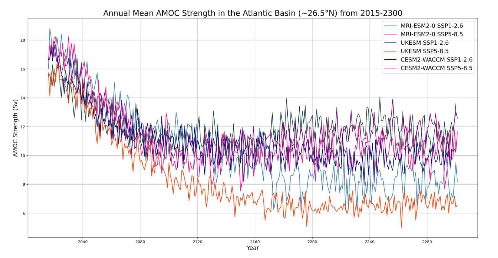
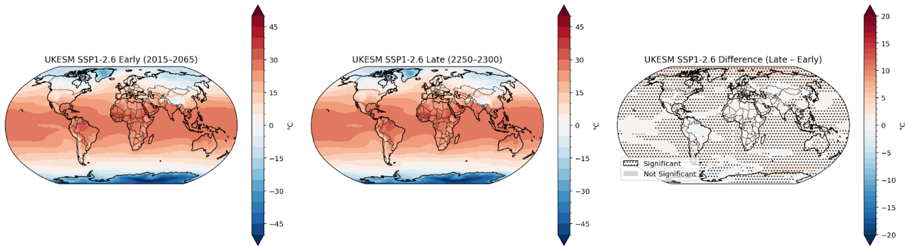
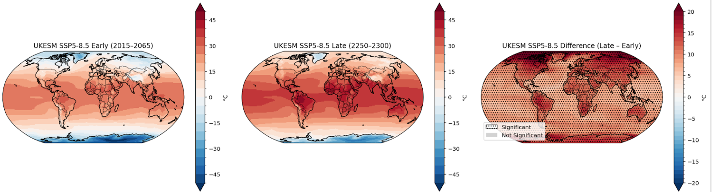

# Python Projects

This repository contains a collection of Python-based data analysis and visualisation projects. Most of the work focuses on large-scale climate and atmospheric behavior patterns under different emissions scenarios. 

# Hydroclimate Analysis of South Africa under Varying AMOC Conditions

Tools used:
- Python
- pandas
- matplotlib

## Timeseries outlining Atlantic Meridional Overturning Circulation Streamfunction from 2015-2300 under different climate models and Shared Socioeconomic Pathways

## Heatmaps indicating global mean temperature in a defined early and late period and the variance between the two

### UK Earth System Model
#### Under SSP 1-2.6

#### Under SSP 5-8.5

